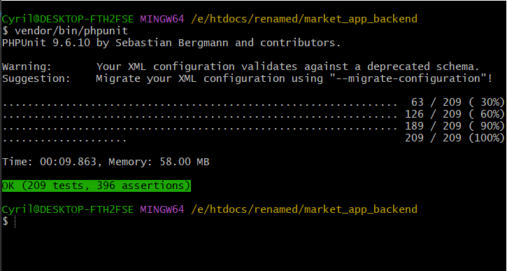

# SuperFix Backend

## Table of Contents
- [Introduction](#introduction)
- [Features](#features)
- [Requirements](#requirements)
- [Getting Started](#getting-started)
    - [Installation](#installation)
    - [Testing](#testing)
- [Deployment](#deployment)
- [Contributing](#contributing)
- [License](#license)

## Introduction

SuperFix Backend is the backend API server for the [SuperFix Android app](https://github.com/cgardesey/SuperFix), a platform for trading products and services. This Laravel-based backend provides essential functionalities for managing users, products, services, and transactions.

## Features

- User authentication and authorization.
- Product management.
- Service management.  
- User account management.
- Shopping cart functionality.
- Order management and history.

## Requirements

To run this Laravel application, you'll need the following software installed on your system:

- PHP (>= 7.4)
- Laravel (>= 5.x)
- MySQL (>= 8.0) or any other compatible database
- Composer (for dependency management)

## Getting Started

### Installation

- Clone this repository to your local machine:
   ```shell
   git git@github.com:cgardesey/market_app_backend.git
   
- Change into the project directory:
   ```shell
   cd market_app_backend
- Install the project dependencies using Composer:
   ```shell
   Composer install
- Install JavaScript dependencies using npm:
   ```bash
      npm install  
- Create a copy of the .env.example file and rename it to .env:
  ```shell
  cp .env.example .env
- Generate a new application key:
  ```shell
   php artisan key:generate
- Configure your database settings in the .env file.
- Run the database migrations:
   ```shell
   php artisan migrate
- Start the development server:
   ```shell
   php artisan serve

- You should now be able to access the application at `http://localhost:8000`.

### Testing
- Run all tests (unit and feature tests):

  ```bash
    # On Windows platform, run:
    vendor\bin\phpunit
  
    # On Unix-like platform, run:
    vendor/bin/phpunit 
All test should pass as shown:



## Deployment
To deploy this application to a production server, follow these steps:
- Set up a production-ready web server (e.g., Nginx, Apache).
- Configure your web server to point to the public directory.
- Update the .env file with production-specific settings.
- Ensure your server meets the PHP and database requirements.

## Contributing
If you'd like to contribute to this project, please follow these steps:
- Fork the repository on GitHub.
- Create a new branch with a descriptive name.
- Commit your changes to the new branch.
- Push the branch to your forked repository.
- Submit a pull request to the original repository.

Please ensure that your code follows the project's coding standards and includes appropriate tests for any new functionality.

If you're looking to integrate with an android frontend project, make sure to check out the repository corresponding to the [android project](https://github.com/cgardesey/SuperFix) for detailed instructions.
## License
This project is open-source and available under the [MIT License](https://opensource.org/licenses/MIT). Feel free to use it as a reference or starting point for your own projects.


